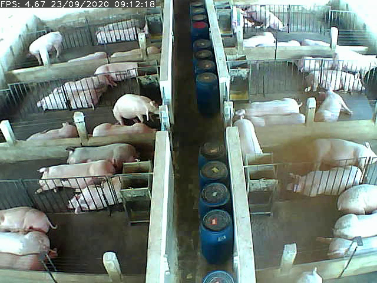
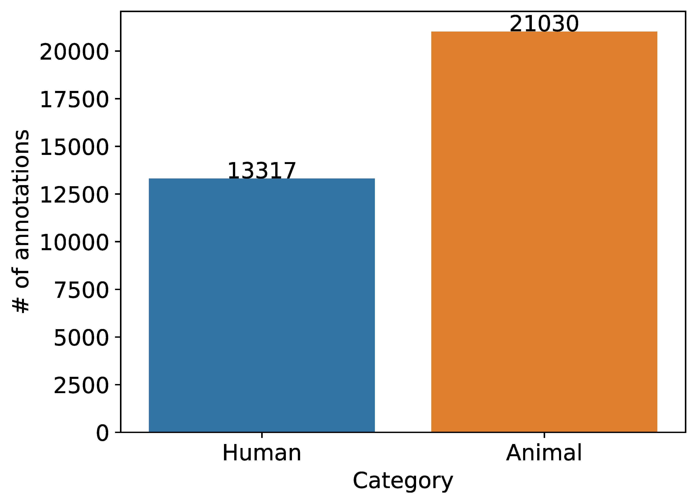
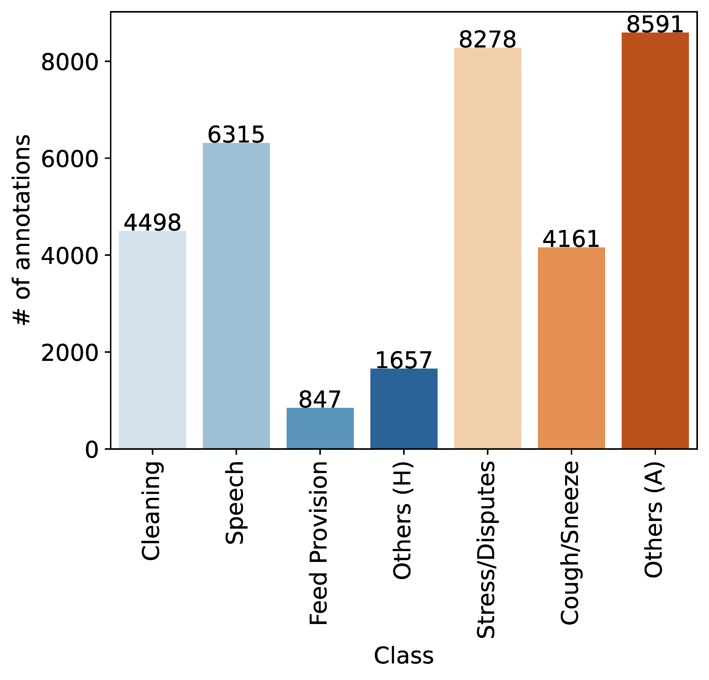

# aSwine Audio Dataset

- [aSwine Audio Dataset](#aswine-audio-dataset)
  - [Download](#download)
  - [Background](#background)
  - [Repository content](#repository-content)
  - [License](#license)
  - [Citing](#citing)
  - [Changelog](#changelog)




The **aSwine** (Annotated Swine) dataset is a weakly labeled collection of ~15 hours of environmental audio recordings from a pig farm. 

The annotation methodology employed a *weak* labeling approach where, for each 5-second interval, one or more labels are assigned based on the presence/absence of associated events. The events within the aSwine dataset are categorized into two primary groups: 1) animal events and 2) human events.

| <sub>Human Events</sub>   | <sub>Animal Events</sub>        |
| :---                      | :---                            |
| <sub>Cleaning</sub>       | <sub>Stress/Disputes</sub>      |
| <sub>Speech</sub>         | <sub>Coughing/Sneezing</sub>    |
| <sub>Feed Provision</sub> | <sub>Other events</sub>         |
| <sub>Other events</sub>   |                                 |

The distributions of annotated events between categories and labels are shown in the pie charts below:

<div style="overflow: auto;">
    
    
</div>

The dataset is intended for the development and evaluation of machine learning models for the detection of human and animal events in a pig farm environment. The dataset is prearranged into a training set and a test set, with the training set containing 80% of the data and the test set containing the remaining 20%. The dataset is available in the form of .wav files, with each file corresponding to a 6-minute audio recording, with a sample rate of 16 kHz. The dataset is accompanied by CSV files containing the annotations for the training and test sets.

A more detailed description of the dataset is available in the original [paper](https://github.com/andremsouza/vision-aed-swine-barn-weak-labels).

[Back to top](#aswine-audio-dataset)

## Download

The dataset can be download as a single .zip file from this repository: [Downlaod aSwine dataset](https://github.com/andremsouza/aswine/archive/refs/heads/main.zip)

## Background

In the midst of the growing interest in applying machine learning (ML) techniques within precision livestock farming (PLF), researchers associated with the Faculty of Veterinary Medicine and Zootechnics (FMVZ) at the University of São Paulo (USP) conducted diverse studies utilizing sensing technologies across various animal species and environmental conditions. The Swine Sound Dataset originated from previous feed additive trials involving groups of finishing pigs. The FMVZ researchers established an infrastructure for continuous 24/7 monitoring, with the data stored in video format (.mp4) and subsequently converted into raw waveform format (.wav) at a sample rate of 16KHz.

The chosen labels were specifically curated to encompass crucial events for observing both human handling and animal behaviors. Detecting these events could significantly aid in auditing day-to-day operations. Throughout the annotation process, an additional category labeled "Other Events" was introduced for each main category (notated as "Others (H)" and "Others (A)"). This inclusive category aims to cover occurrences not addressed by existing labels but potentially relevant in detection scenarios. Examples of such events may include chirping birds, calls of wild animals, unidentified loud noises, and sounds from automobiles. This category accommodates diverse and unforeseen events that hold potential significance in the context of detection.

[Back to top](#aswine-audio-dataset)

## Repository content

- [audio/*.wav](audio/): audio recordings in .wav format (6-minute, 16 kHz, mono) with the following naming convention: `ALA_E_2_{YEAR}-{MONTH}-{DAY}_{HOUR}-{MINUTE}-{SECOND}_{MILLISECOND}.wav`
- [meta/raw/*.csv](meta/raw/): Raw 5-second annotations in .csv format for the full set, training set, and test set, with the following structure:
  - `Timestamp`: timestamp of the 5-second interval
  - *`Duração`*: duration of the 5-second interval
  - *`Limpeza de Baia`*: binary label for the cleaning event
  - *`Fala Humana`*: binary label for the speech event
  - *`Alimentação de Baias`*: binary label for the feed provision event
  - *`OutrosH`*: binary label for other human events
  - *`EstresseDisputas`*: binary label for the stress/disputes event
  - *`TosseEspirro`*: binary label for the coughing/sneezing event
  - *`OutrosA`*: binary label for other animal events
- [meta/1s/*.csv](meta/1s/): Processed 1-second annotations in .csv format for the full set, training set, and test set, with the following structure:
  - `audio_file_path`: path to the corresponding audio file
  - *`offset`*: offset in seconds from the start of the audio file
  - *`duration`*: duration of the 1-second interval
  - *`Limpeza de Baia`*: binary label for the cleaning event
  - *`Fala Humana`*: binary label for the speech event
  - *`Alimentação de Baias`*: binary label for the feed provision event
  - *`OutrosH`*: binary label for other human events
  - *`EstresseDisputas`*: binary label for the stress/disputes event
  - *`TosseEspirro`*: binary label for the coughing/sneezing event
  - *`OutrosA`*: binary label for other animal events
- [meta/1s_pruned/*.csv](meta/1s_pruned/): Removed invalid annotations, i.e., annotations at the boundaries of two different files, then processed 1-second annotations in .csv format for the full set, training set, and test set, with the following structure:
  - `audio_file_path`: path to the corresponding audio file
  - *`offset`*: offset in seconds from the start of the audio file
  - *`duration`*: duration of the 1-second interval
  - *`Limpeza de Baia`*: binary label for the cleaning event
  - *`Fala Humana`*: binary label for the speech event
  - *`Alimentação de Baias`*: binary label for the feed provision event
  - *`OutrosH`*: binary label for other human events
  - *`EstresseDisputas`*: binary label for the stress/disputes event
  - *`TosseEspirro`*: binary label for the coughing/sneezing event
  - *`OutrosA`*: binary label for other animal events

[Back to top](#aswine-audio-dataset)

## License

The dataset is released under the [Creative Commons Attribution-NonCommercial 4.0 International](https://creativecommons.org/licenses/by-nc/4.0/) license.

[Back to top](#aswine-audio-dataset)

## Citing

If you find this dataset useful, please consider citing the original paper (accepted):

```latex
@article{souza2025aed,
  title={Deep Learning Solutions for Audio Event Detection in a Swine Barn Using Environmental Audio and Weak Labels},
  author={Souza, Andr{\'e} Moreira and Sousa, Elaine Parros Machado de and Kobayashi, Livia Lissa and Tassoni, Lucas Andrietta and Garbossa, Cesar Augusto Pospissil and Ventura, Ricardo Vieira},
  journal={Applied Intelligence},
  year={2025},
  publisher={Springer}
}
```

[Back to top](#aswine-audio-dataset)

## Changelog

[Back to top](#aswine-audio-dataset)
